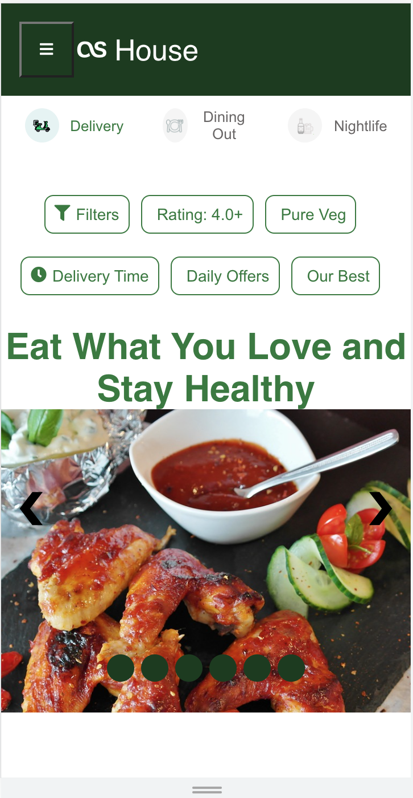

# Cretad a Single-page Application for food delivery (asHouse)

## Description

With this application user can access few restaurants available near by of their choice. User can create account and login using username: cat and password greater then 4 digits. After successfull login, username with greeting will be displayed at right top.
There are different tabs:
* Home
* Restaurants
* Review
* SignIn
* SignUp
* menu

### Home
Home page contains location dropdown, restaurant/cuisine search with auto complete feature and top 3 dining and take out places.
### Restaurants
* At restaurents tab there are three navigations delivery, dining and Nightlife

* Menu will be diaplayed once we click on any restaurant

### Review

Review page contains different blogger review, which has next, previous and random clicks

### SignIn & SignUp
Has validation check for all the fields and required fields are marked *

About and privacy policy is present at the bottom in footer

## Complex UI elements
1. Hamburger menu at 600px
2. Carousel is present at Product (restaurants) page, with auto slide feature
3. Dropdown to Search cities
4. Search suggestion while searching restaurant

## loading indicator
When a use sign up or sign in a loading indication will be visible untill the response come from signIn or signUp. As we are using fake services it get dismissed after few seconds

## images/Font Awesome icons

All the images are taken from 
https://pixabay.com/ 
Its policies says that it can be used by anyone

Added few images for desktop and mobile view

 

 Home Page (desktop view)

Restaurent Page (desktop view)

Home Page (Mobile view)

Restaurent Page (mobile view)

Sing In Page (mobile view)

Sign In with error page (mobile view)